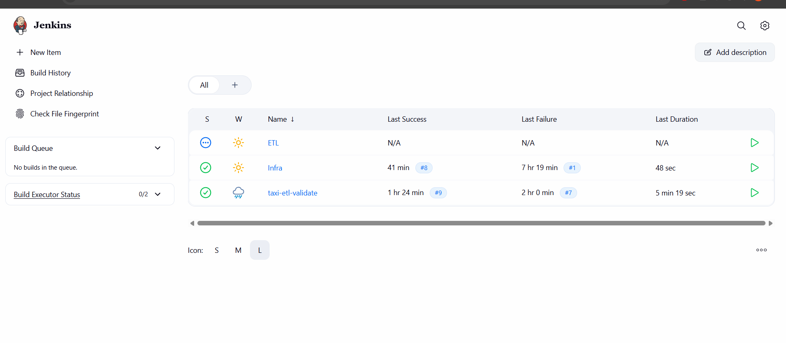
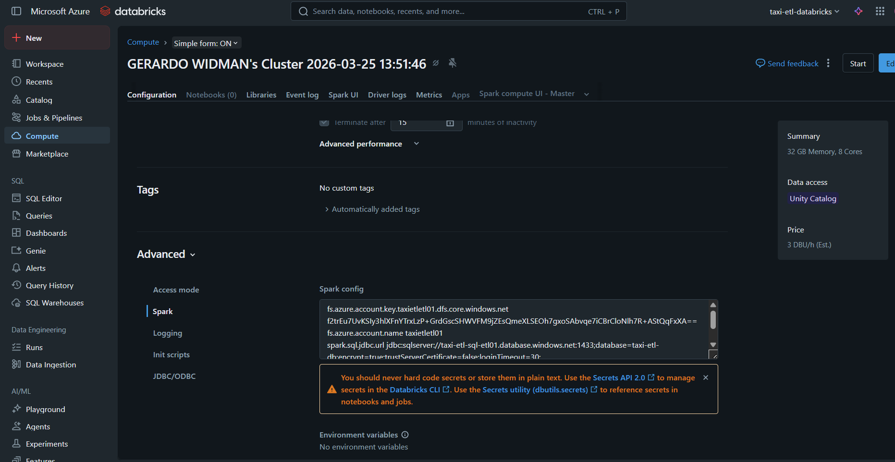
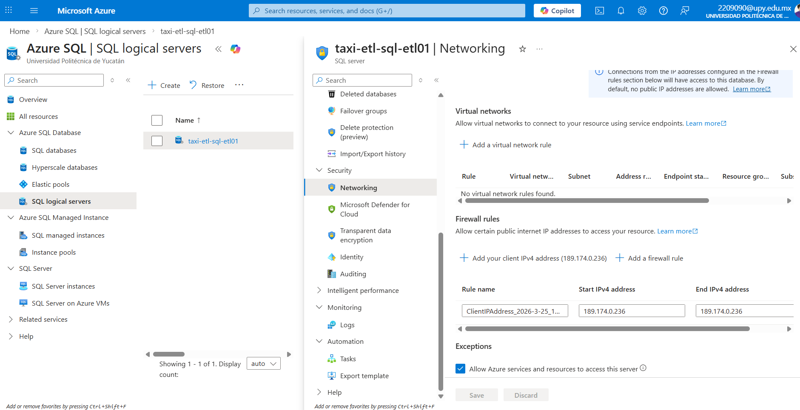
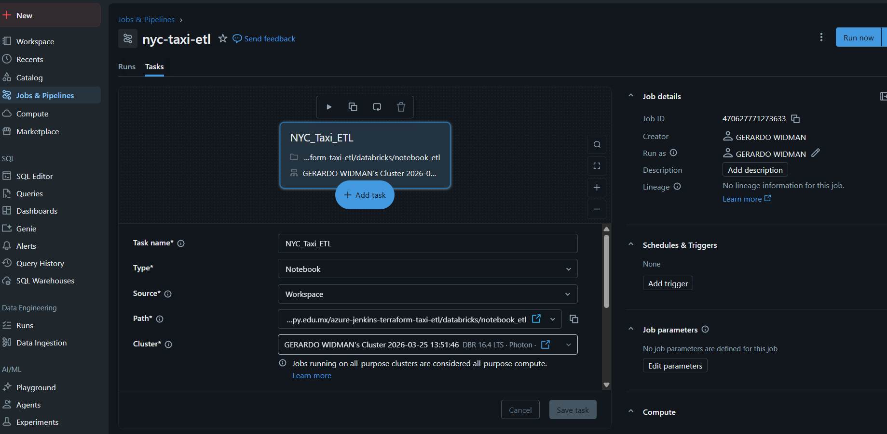
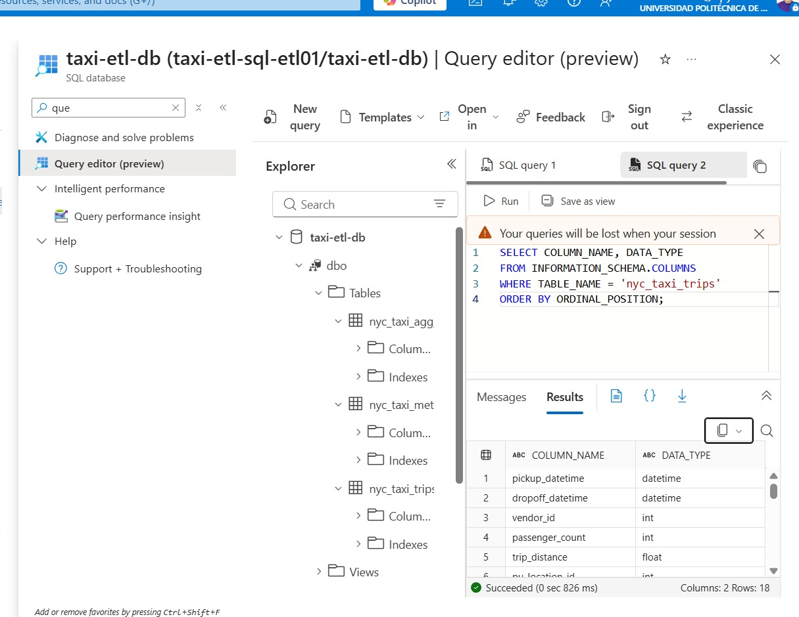

# NYC Taxi ETL Pipeline - Azure + Jenkins + Databricks + Terraform

End-to-end automated ETL pipeline for processing NYC Taxi trip data using Jenkins orchestration, Azure Blob Storage, Databricks Spark processing, and Azure SQL Database analytics.

## 📋 Table of Contents

- [Architecture](#architecture)
- [Tech Stack](#tech-stack)
- [Project Structure](#project-structure)
- [Prerequisites](#prerequisites)
- [Quick Start](#quick-start)
- [Manual Configuration Steps](#manual-configuration-steps)
- [Pipeline Details](#pipeline-details)
- [File Descriptions](#file-descriptions)
- [Testing](#testing)
- [Monitoring](#monitoring)

---

## 🏗️ Architecture
```
┌─────────────────────────────────────────────────────────────────┐
│                         Jenkins (Orchestrator)                   │
└────────┬────────────────────┬────────────────────┬──────────────┘
         │                    │                    │
         ▼                    ▼                    ▼
    ┌─────────┐         ┌─────────┐         ┌──────────┐
    │Pipeline 1│         │Pipeline 2│         │Pipeline 3│
    │  Infra  │         │   ETL   │         │ Validate │
    └────┬────┘         └────┬────┘         └────┬─────┘
         │                   │                    │
         ▼                   ▼                    ▼
    Terraform          Upload to Blob      Quality Checks
    Creates:           Trigger Databricks   on SQL Database
    • Storage          Spark Processing     
    • Databricks       Write to SQL         
    • SQL Database                          
```




**Data Flow:**
1. Raw parquet files → Azure Blob Storage (`raw/` container)
2. Databricks Spark job processes data
3. Transformed data → Azure Blob Storage (`processed/` container)
4. Final data loaded into Azure SQL Database
5. Validation pipeline runs quality checks

---

## 🧩 Tech Stack

| Component | Purpose | Version |
|-----------|---------|---------|
| **Jenkins** | CI/CD orchestration | 2.541.3 |
| **Terraform** | Infrastructure as Code | >= 1.0 |
| **Azure Blob Storage** | Data Lake (raw/processed) | - |
| **Databricks** | Spark data processing | Runtime 14.3+ |
| **Azure SQL Database** | Analytics warehouse | - |
| **Python** | ETL scripts and validation | 3.13.5 |
| **Docker** | Jenkins containerization | - |
| **pytest** | Unit and integration testing | 9.0.2 |

---

## 📁 Project Structure
```
azure-taxi-etl/
│
├── terraform/                          # Infrastructure as Code
│   ├── main.tf                         # Main Terraform configuration
│   ├── variables.tf                    # Input variables (location, names, etc.)
│   ├── outputs.tf                      # Output values (connection strings, URLs)
│   ├── storage.tf                      # Azure Storage Account + containers
│   ├── databricks.tf                   # Databricks workspace configuration
│   ├── sql.tf                          # Azure SQL Server + Database
│   ├── datafactory.tf                  # (Not used - for future expansion)
│   ├── terraform.tfvars                # Variable values (gitignored)
│   └── .terraform.lock.hcl             # Provider version lock file
│
├── functions/                          # Python ETL scripts
│   ├── upload.py                       # Uploads parquet to Blob Storage
│   ├── run_databricks.py               # Triggers Databricks job via API
│   └── validate.py                     # Runs SQL quality checks
│
├── databricks/                         # Databricks configuration
│   ├── notebook_etl.py                 # Spark transformations notebook
│   └── config.json                     # Databricks job configuration
│
├── tests/                              # Test suites
│   ├── unit/
│   │   └── test_transforms.py          # Unit tests (47 tests, 80% coverage)
│   ├── integration/
│   │   └── test_pipeline.py            # End-to-end pipeline tests
│   └── data_quality/
│       └── test_quality.py             # Data quality validation tests
│
├── data/                               # Sample data
│   └── yellow_tripdata_2024-01.parquet # NYC taxi trip data (Jan 2024)
│
├── .github/                            # GitHub Actions (future CI/CD)
│   └── workflows/
│
├── Jenkinsfile.infra                   # Pipeline 1: Infrastructure deployment
├── Jenkinsfile.etl                     # Pipeline 2: ETL execution
├── Jenkinsfile.validate                # Pipeline 3: Data validation
│
├── docker-compose.yml                  # Jenkins container orchestration
├── Dockerfile.jenkins                  # Custom Jenkins image with tools
│
├── .env.example                        # Environment variables template
├── .env                                # Actual env vars (gitignored)
├── .gitignore                          # Git ignore rules
├── setup.cfg                           # pytest configuration
└── README.md                           # This file
```

---

## 📋 Prerequisites

### Required Software

- **Docker Desktop** - For running Jenkins locally
- **Azure CLI** - For Azure resource management
- **Terraform** >= 1.0 - For infrastructure provisioning
- **Python** 3.9+ - For running ETL scripts locally
- **Git** - For version control

### Required Azure Resources

- Active Azure subscription
- Sufficient quota for:
  - 1 Storage Account
  - 1 Databricks Workspace
  - 1 SQL Database (Basic tier)
- Service Principal with Contributor role

### Required Accounts

- Azure account with admin access
- Databricks workspace access (created by Terraform)
- GitHub account (for repository hosting)

---

## 🚀 Quick Start

### 1. Clone Repository
```bash
git clone https://github.com/widmanhg/azure-jenkins-terraform-taxi-etl.git
cd azure-taxi-etl
```

### 2. Create Azure Service Principal
```bash
az login

# Create Service Principal for Terraform
az ad sp create-for-rbac \
  --name "terraform-sp-taxi-etl" \
  --role="Contributor" \
  --scopes="/subscriptions/YOUR_SUBSCRIPTION_ID"
```

Save the output:
```json
{
  "appId": "xxxxxxxx-xxxx-xxxx-xxxx-xxxxxxxxxxxx",
  "displayName": "terraform-sp-taxi-etl",
  "password": "your-client-secret",
  "tenant": "your-tenant-id"
}
```

### 3. Configure Environment Variables
```bash
cp .env.example .env
```

Edit `.env` with your values:
```env
# Azure Authentication
AZURE_SUBSCRIPTION_ID=your-subscription-id
AZURE_TENANT_ID=your-tenant-id
AZURE_CLIENT_ID=your-app-id
AZURE_CLIENT_SECRET=your-client-secret

# Terraform Variables
TF_VAR_location=eastus
TF_VAR_sql_admin_password=YourSecurePassword123!

# Azure Storage (filled after Terraform run)
AZURE_STORAGE_ACCOUNT=taxietletl01
AZURE_STORAGE_CONNECTION_STRING=DefaultEndpointsProtocol=https;...

# Databricks (filled after workspace creation)
DATABRICKS_HOST=https://adb-xxxxx.azuredatabricks.net
DATABRICKS_TOKEN=dapi...
```

### 4. Start Jenkins with Docker
```bash
docker-compose up -d
```

Access Jenkins at: `http://localhost:8080`

**Get initial admin password:**
```bash
docker exec jenkins cat /var/jenkins_home/secrets/initialAdminPassword
```

### 5. Install Jenkins Plugins

During first-time setup, install:
- Pipeline
- Git
- Credentials Binding
- Blue Ocean (optional, for better UI)

---

## ⚙️ Manual Configuration Steps

After automated setup, these steps must be performed manually:

### Step 1: Configure Jenkins Credentials

Navigate to: `Jenkins → Manage Jenkins → Credentials → System → Global credentials → Add Credentials`

Add the following credentials:

#### A. Service Principal for Terraform

| Field | Value |
|-------|-------|
| **Kind** | Secret file |
| **ID** | `AZURE_SERVICE_PRINCIPAL` |
| **File** | Upload JSON with SP credentials |
| **Description** | Azure Service Principal for Terraform |

JSON file content:
```json
{
  "clientId": "your-app-id",
  "clientSecret": "your-client-secret",
  "subscriptionId": "your-subscription-id",
  "tenantId": "your-tenant-id"
}
```

#### B. Azure Storage Credentials

| ID | Kind | Value | Description |
|----|------|-------|-------------|
| `azure-storage-connection-string` | Secret text | `DefaultEndpointsProtocol=https;AccountName=taxietletl01;AccountKey=...` | Full connection string |
| `azure-storage-account-name` | Secret text | `taxietletl01` | Storage account name only |

#### C. Databricks Credentials

| ID | Kind | Value | Description |
|----|------|-------|-------------|
| `databricks-token` | Secret text | `dapi...` | Personal access token |
| `databricks-host` | Secret text | `https://adb-xxxxx.azuredatabricks.net` | Workspace URL |

**How to get Databricks token:**
1. Go to Databricks workspace
2. Click your user icon (top right) → User Settings
3. Developer → Access tokens → Generate new token
4. Copy and save the token

#### D. SQL Database Credentials

| ID | Kind | Value | Description |
|----|------|-------|-------------|
| `azure-sql-username` | Secret text | `sqladmin` | SQL admin username |
| `azure-sql-password` | Secret text | `Genesis1.1` | SQL admin password |
| `sql_admin_password` | Secret text | `Genesis1.1` | For Terraform variable |

### Step 2: Configure Databricks Cluster Spark Config

After Terraform creates the Databricks workspace:

1. **Create a Compute Cluster:**
   - Go to: `Databricks → Compute → Create Cluster`
   - Cluster name: `taxi-etl-cluster`
   - Runtime version: 14.3 LTS or higher
   - Node type: Standard_DS3_v2 (or similar)

2. **Add Spark Configuration:**
   - In cluster settings, expand **Advanced Options**
   - Go to **Spark** tab
   - Add the following configuration:
```properties
fs.azure.account.key.taxietletl01.dfs.core.windows.net f2trEu7UvKSIy3hlXFnYTrxLzP+GrdGscSHWVFM9jZEsQmeXLSEOh7gxoSAbvqe7iCBrCloNlh7R+AStQqFxXA==
fs.azure.account.name taxietletl01
spark.sql.jdbc.url jdbc:sqlserver://taxi-etl-sql-etl01.database.windows.net:1433;database=taxi-etl-db;encrypt=true;trustServerCertificate=false;loginTimeout=30;
spark.sql.jdbc.user sqladmin
spark.sql.jdbc.password Genesis1.1
```





**Important:** Replace these values with outputs from your Terraform run:
- Storage account key: Found in Terraform output `storage_account_key`
- SQL connection string: Found in Terraform output `sql_server_fqdn`

### Step 3: Configure Azure SQL Database Networking

Allow access to SQL Database from your IP and Azure services:

#### Option A: Azure Portal
1. Go to: `Azure Portal → SQL Server (taxi-etl-sql-etl01) → Networking`
2. Under **Firewall rules**:
   - Click "Add client IP" to add your current IP
   - Enable "Allow Azure services and resources to access this server"
3. Click "Save"




#### Option B: Azure CLI
```bash
# Get your public IP
curl ifconfig.me

# Add firewall rule for your IP
az sql server firewall-rule create \
  --resource-group taxi-etl-rg \
  --server taxi-etl-sql-etl01 \
  --name AllowMyIP \
  --start-ip-address YOUR_PUBLIC_IP \
  --end-ip-address YOUR_PUBLIC_IP

# Allow Azure services
az sql server firewall-rule create \
  --resource-group taxi-etl-rg \
  --server taxi-etl-sql-etl01 \
  --name AllowAzureServices \
  --start-ip-address 0.0.0.0 \
  --end-ip-address 0.0.0.0
```

### Step 4: Upload Databricks Notebook and Create Job

#### A. Upload the Notebook

**Option 1: Databricks UI**
1. Go to: `Databricks → Workspace → Users → your-email`
2. Click the dropdown → Import
3. Select `databricks/notebook_etl.py`
4. Choose Python as the language

**Option 2: Databricks CLI**
```bash
# Install Databricks CLI
pip install databricks-cli

# Configure
databricks configure --token

# Upload notebook
databricks workspace import \
  databricks/notebook_etl.py \
  /Users/your-email/notebook_etl \
  --language PYTHON
```

### Step 4: Upload Databricks Notebook and Create Job

#### A. Import Repository into Databricks Workspace

Before creating the Databricks job, ensure the repository is imported into your Databricks workspace:

1. Go to: `Databricks → Repos`.
2. Click **Add Repo → Import**.
3. Enter your repository URL: `https://github.com/widmanhg/azure-jenkins-terraform-taxi-etl.git`.
4. Select the branch (`main`) and click **Import**.
5. Verify that the notebook `notebook_etl.py` is visible under the imported repo.

#### B. Upload the Notebook (if not using Repos)

**Option 1: Databricks UI**  
1. Go to: `Databricks → Workspace → Users → your-email`.  
2. Click the dropdown → Import.  
3. Select `databricks/notebook_etl.py`.  
4. Choose Python as the language.  




**Option 2: Databricks CLI**  
```bash
# Install Databricks CLI
pip install databricks-cli

# Configure
databricks configure --token

# Upload notebook
databricks workspace import \
  databricks/notebook_etl.py \
  /Users/your-email/notebook_etl \
  --language PYTHON

### Step 5: Create Jenkins Pipelines

Create three pipeline jobs in Jenkins:

#### Pipeline 1: Infrastructure

1. Click "New Item"
2. Name: `taxi-etl-infra`
3. Type: Pipeline
4. Under "Pipeline" section:
   - Definition: Pipeline script from SCM
   - SCM: Git
   - Repository URL: `https://github.com/widmanhg/azure-jenkins-terraform-taxi-etl`
   - Branch: `*/main`
   - Script Path: `Jenkinsfile.infra`
5. Save

#### Pipeline 2: ETL

1. Click "New Item"
2. Name: `ETL`
3. Type: Pipeline
4. Under "Pipeline" section:
   - Definition: Pipeline script from SCM
   - SCM: Git
   - Repository URL: `https://github.com/widmanhg/azure-jenkins-terraform-taxi-etl`
   - Branch: `*/main`
   - Script Path: `Jenkinsfile.etl`
5. Save

#### Pipeline 3: Validation

1. Click "New Item"
2. Name: `taxi-etl-validate`
3. Type: Pipeline
4. Under "Pipeline" section:
   - Definition: Pipeline script from SCM
   - SCM: Git
   - Repository URL: `https://github.com/widmanhg/azure-jenkins-terraform-taxi-etl`
   - Branch: `*/main`
   - Script Path: `Jenkinsfile.validate`
   - This build is parameterized:
     - String parameter: `RUN_DATE` (default: `2024-01-15`)
     - String parameter: `DATABRICKS_RUN_ID` (default: empty)
5. Save

---

## 🔄 Pipeline Details

### Pipeline 1: Infrastructure (`Jenkinsfile.infra`)

**Purpose:** Provisions all Azure infrastructure using Terraform

**Stages:**
1. **Checkout** - Clones the Git repository
2. **Terraform Init** - Initializes Terraform providers
3. **Terraform Plan** - Creates execution plan
4. **Terraform Apply** - Provisions infrastructure
5. **Save Outputs** - Captures Terraform outputs

**Execution:**
```bash
# Run manually from Jenkins UI
Jenkins → taxi-etl-infra → Build Now
```

**Resources Created:**
- Resource Group: `taxi-etl-rg`
- Storage Account: `taxietletl01`
  - Container: `raw` (for incoming data)
  - Container: `processed` (for transformed data)
- Databricks Workspace: `taxi-etl-databricks`
- SQL Server: `taxi-etl-sql-etl01`
- SQL Database: `taxi-etl-db`

**Duration:** ~5-10 minutes

### Pipeline 2: ETL (`Jenkinsfile.etl`)

**Purpose:** Executes the full ETL process from raw data to database

**Stages:**

1. **Checkout**
   - Clones repository
   - Fetches latest code

2. **Setup Python**
   - Creates virtual environment
   - Installs Python dependencies:
     - `azure-storage-blob` - Azure Blob operations
     - `databricks-sdk` - Databricks API client
     - `pyodbc` - SQL database connection
     - `pandas` - Data manipulation
     - `pyarrow` - Parquet file handling
     - `python-dotenv` - Environment variable management
     - `requests` - HTTP client
     - `pytest` - Testing framework
     - `pytest-cov` - Code coverage

3. **Unit Tests**
   - Runs pytest test suite
   - Requires minimum 70% code coverage
   - 47 tests covering:
     - Upload functionality
     - Data transformations
     - Validation logic

4. **Upload to Blob Storage**
   - Executes `functions/upload.py`
   - Uploads parquet file to `raw/` container
   - Path format: `raw/nyc-taxi/YYYY/MM/DD/filename.parquet`
   - Returns blob URL and name

5. **Run Databricks ETL**
   - Executes `functions/run_databricks.py`
   - Triggers Databricks job via REST API
   - Monitors job execution (polls every 30 seconds)
   - Maximum wait time: 2 hours
   - Job performs:
     - Read parquet from blob storage
     - Apply transformations (clean, aggregate)
     - Write to `processed/` container
     - Load into SQL database

6. **Trigger Validation**
   - Calls Pipeline 3 (`taxi-etl-validate`)
   - Passes `RUN_DATE` and `DATABRICKS_RUN_ID`
   - Runs asynchronously (doesn't wait for completion)

**Execution:**
```bash
# Run manually
Jenkins → ETL → Build Now

# Or trigger via webhook/cron
```

**Duration:** ~10-15 minutes (depending on data size)

### Pipeline 3: Validation (`Jenkinsfile.validate`)

**Purpose:** Runs quality checks on processed data in SQL database

**Parameters:**
- `RUN_DATE` - Date to validate (format: YYYY-MM-DD)
- `DATABRICKS_RUN_ID` - Optional Databricks run ID for traceability

**Stages:**

1. **Checkout**
   - Clones repository

2. **Setup Python**
   - Creates virtual environment
   - Installs dependencies

3. **Run Validation**
   - Executes `functions/validate.py`
   - Connects to Azure SQL Database
   - Runs quality checks:
     - **Row Count Check:** Ensures data was loaded
     - **Null Check:** Validates critical columns have no nulls
     - **Date Range Check:** Confirms dates are within expected range
     - **Numeric Range Check:** Validates fares, distances are reasonable
     - **Duplicate Check:** Ensures no duplicate records

**Execution:**
```bash
# Triggered automatically by ETL pipeline
# Or run manually with parameters:
Jenkins → taxi-etl-validate → Build with Parameters
```

**Duration:** ~2-5 minutes

---

## 📄 File Descriptions

### Root Configuration Files

#### `.env` / `.env.example`
Environment variables for local development and Jenkins.

**Contains:**
- Azure authentication credentials
- Terraform variables
- Storage connection strings
- Databricks configuration
- SQL credentials

**Security:** `.env` is gitignored, only `.env.example` is committed

#### `.gitignore`
Defines files and directories to exclude from version control.

**Ignores:**
- `.env` - Sensitive credentials
- `*.tfstate` - Terraform state files
- `*.tfvars` - Terraform variable files
- `venv/` - Python virtual environments
- `__pycache__/` - Python cache files

#### `setup.cfg`
Pytest configuration file.

**Settings:**
- Test discovery paths
- Coverage requirements (70% minimum)
- Output formatting
- Test markers

#### `docker-compose.yml`
Orchestrates Jenkins container.

**Configuration:**
- Maps port 8080 (web UI) and 50000 (agent communication)
- Persists Jenkins data in Docker volume
- Mounts Docker socket for Docker-in-Docker capability

#### `Dockerfile.jenkins`
Custom Jenkins image with pre-installed tools.

**Includes:**
- Jenkins LTS base image
- Python 3.9+
- Terraform
- Azure CLI
- Required plugins

### Terraform Files (`terraform/`)

#### `main.tf`
Main Terraform configuration.

**Defines:**
- Azure provider configuration
- Backend for state management
- Resource group creation

#### `variables.tf`
Input variable definitions.

**Variables:**
- `location` - Azure region (default: eastus)
- `resource_group_name` - Resource group name
- `storage_account_name` - Storage account name
- `sql_admin_username` - SQL admin username
- `sql_admin_password` - SQL admin password (sensitive)
- `databricks_sku` - Databricks pricing tier

#### `outputs.tf`
Terraform output values.

**Outputs:**
- `storage_account_name` - For blob operations
- `storage_account_key` - For Spark configuration
- `databricks_workspace_url` - Workspace access URL
- `sql_server_fqdn` - SQL connection endpoint
- `sql_database_name` - Database name

#### `storage.tf`
Azure Storage Account configuration.

**Creates:**
- Storage account with hierarchical namespace (ADLS Gen2)
- `raw` container - For incoming parquet files
- `processed` container - For transformed data
- Network rules and access controls

#### `databricks.tf`
Databricks workspace configuration.

**Creates:**
- Databricks workspace
- Managed resource group
- Network configuration
- VNET integration (optional)

#### `sql.tf`
Azure SQL Database configuration.

**Creates:**
- SQL Server
- SQL Database (Basic tier)
- Firewall rules
- Admin login credentials

#### `datafactory.tf`
Azure Data Factory configuration (currently unused).

**Note:** Included for future expansion if ADF orchestration is needed instead of Jenkins.

### Python Scripts (`functions/`)

#### `upload.py`
Uploads parquet files to Azure Blob Storage.

**Functionality:**
- Accepts file path and container name as arguments
- Reads local parquet file
- Creates container if it doesn't exist
- Uploads to blob with date-partitioned path: `nyc-taxi/YYYY/MM/DD/filename.parquet`
- Returns blob URL and blob name

**Usage:**
```bash
python functions/upload.py \
  --file data/yellow_tripdata_2024-01.parquet \
  --container raw
```

**Environment Variables Required:**
- `AZURE_STORAGE_CONNECTION_STRING`

**Output:**
```
BLOB_URL=https://taxietletl01.blob.core.windows.net/raw/nyc-taxi/2026/03/25/yellow_tripdata_2024-01.parquet
BLOB_NAME=nyc-taxi/2026/03/25/yellow_tripdata_2024-01.parquet
```

#### `run_databricks.py`
Triggers and monitors Databricks job execution.

**Functionality:**
- Searches for Databricks job by name
- Constructs ABFSS path for input data
- Triggers job via REST API with parameters:
  - `input_path` - ABFSS path to parquet file
  - `output_container` - Destination container
  - `run_date` - Extracted from blob path
- Polls job status every 30 seconds
- Returns when job completes (SUCCESS/FAILED/TIMEOUT)

**Usage:**
```bash
python functions/run_databricks.py \
  --blob-name nyc-taxi/2026/03/25/yellow_tripdata_2024-01.parquet \
  --blob-container raw \
  --job-name nyc-taxi-etl
```

**Environment Variables Required:**
- `DATABRICKS_TOKEN`
- `DATABRICKS_HOST`
- `AZURE_STORAGE_ACCOUNT`

**Output:**
```
DATABRICKS_RUN_ID=642886630954249
DATABRICKS_STATUS=SUCCESS
```

#### `validate.py`
Executes data quality checks on SQL database.

**Functionality:**
- Connects to Azure SQL Database
- Runs validation queries:
  1. **Row count** - Ensures data exists for the run date
  2. **Null checks** - Validates no nulls in: `pickup_datetime`, `passenger_count`, `trip_distance`, `fare_amount`
  3. **Date range** - Confirms pickup dates are within expected range
  4. **Numeric ranges** - Validates:
     - `passenger_count` between 1-6
     - `trip_distance` > 0
     - `fare_amount` > 0
  5. **Duplicates** - Checks for duplicate trip records
- Logs results
- Exits with code 0 (success) or 1 (failure)

**Usage:**
```bash
python functions/validate.py --run-date 2024-01-15
```

**Environment Variables Required:**
- `AZURE_SQL_SERVER`
- `AZURE_SQL_DATABASE`
- `AZURE_SQL_USERNAME`
- `AZURE_SQL_PASSWORD`

### Databricks Files (`databricks/`)

#### `notebook_etl.py`
Spark notebook for data transformations.

**Functionality:**
- Accepts notebook parameters:
  - `input_path` - ABFSS path to source parquet
  - `output_container` - Destination container
  - `run_date` - Processing date
- Reads raw parquet data using Spark
- Applies transformations:
  - Filter invalid records
  - Calculate trip duration
  - Clean fare amounts
  - Add processing timestamp
  - Aggregate metrics (if needed)
- Writes to:
  1. Processed container as parquet
  2. Azure SQL Database using JDBC
- Logs execution metrics

**Transformations:**
- Remove records with null pickup/dropoff times
- Filter trips with distance < 0 or fare < 0
- Calculate `trip_duration_minutes`
- Add `processing_date` column
- Repartition for optimal storage

#### `config.json`
Databricks job configuration (for CLI/API deployment).

**Contains:**
- Job name
- Task configuration
- Cluster settings
- Notebook path
- Libraries
- Schedules (if any)

### Jenkins Pipeline Files

#### `Jenkinsfile.infra`
Declarative Jenkins pipeline for infrastructure provisioning.

**Stages:**
1. Checkout SCM
2. Terraform Init
3. Terraform Plan
4. Terraform Apply (requires manual approval in production)
5. Output Results

**Features:**
- Uses Azure Service Principal credentials
- Handles Terraform state
- Captures outputs for downstream use

#### `Jenkinsfile.etl`
Declarative Jenkins pipeline for ETL execution.

**Environment Variables:**
- `PARQUET_FILE` - Source data file
- `BLOB_CONTAINER` - Target container
- `DATABRICKS_JOB` - Job name in Databricks
- `VALIDATE_JOB` - Validation pipeline name

**Stages:**
1. Checkout
2. Setup Python
3. Unit Tests (with coverage reporting)
4. Upload to Blob Storage
5. Run Databricks ETL
6. Trigger Validation

**Post Actions:**
- Success: Displays summary with blob URL, run ID
- Failure: Logs error details
- Always: Cleans up virtual environment

#### `Jenkinsfile.validate`
Declarative Jenkins pipeline for data validation.

**Parameters:**
- `RUN_DATE` (string) - Date to validate
- `DATABRICKS_RUN_ID` (string) - Traceability ID

**Stages:**
1. Checkout
2. Setup Python
3. Run Validation Script

**Features:**
- Can be triggered automatically or manually
- Accepts date parameter for flexibility
- Logs detailed validation results

### Test Files (`tests/`)

#### `tests/unit/test_transforms.py`
Unit tests for Python functions.

**Test Coverage:**
- Upload functionality (blob creation, naming, error handling)
- Databricks job triggering
- Validation logic
- Error scenarios

**Total Tests:** 47
**Coverage:** 80% (exceeds 70% requirement)

**Test Classes:**
- `TestUpload` - Tests for `upload.py`
- `TestDatabricks` - Tests for `run_databricks.py`
- `TestValidate` - Tests for `validate.py`

#### `tests/integration/test_pipeline.py`
End-to-end integration tests.

**Tests:**
- Full ETL flow from upload to validation
- Databricks job execution
- SQL database connectivity
- Data consistency across pipeline stages

#### `tests/data_quality/test_quality.py`
Data quality validation tests.

**Tests:**
- Schema validation
- Data type consistency
- Business rule validation
- Statistical outlier detection

### Data Files (`data/`)

#### `yellow_tripdata_2024-01.parquet`
Sample NYC taxi trip data for January 2024.

**Schema:**
- `VendorID` - Vendor identifier
- `tpep_pickup_datetime` - Pickup timestamp
- `tpep_dropoff_datetime` - Dropoff timestamp
- `passenger_count` - Number of passengers
- `trip_distance` - Trip distance in miles
- `RatecodeID` - Rate code
- `store_and_fwd_flag` - Store and forward flag
- `PULocationID` - Pickup location ID
- `DOLocationID` - Dropoff location ID
- `payment_type` - Payment method
- `fare_amount` - Base fare
- `extra` - Extra charges
- `mta_tax` - MTA tax
- `tip_amount` - Tip amount
- `tolls_amount` - Tolls
- `improvement_surcharge` - Improvement surcharge
- `total_amount` - Total fare

**Size:** ~50MB
**Rows:** ~3 million records

---

## 🧪 Testing

### Running Unit Tests Locally
```bash
# Create virtual environment
python3 -m venv venv
source venv/bin/activate  # Windows: venv\Scripts\activate

# Install dependencies
pip install -r requirements.txt

# Run all tests
pytest tests/unit/ -v

# Run with coverage
pytest tests/unit/ --cov=functions --cov-report=html

# View coverage report
open htmlcov/index.html  # macOS
start htmlcov/index.html # Windows
```

### Running Integration Tests
```bash
# Requires Azure resources to be deployed
pytest tests/integration/ -v
```

### Test Coverage Requirements

- **Minimum Coverage:** 70%
- **Current Coverage:** 80%
- **Coverage Tool:** pytest-cov

**Coverage by Module:**
- `functions/run_databricks.py`: 72%
- `functions/upload.py`: 72%
- `functions/validate.py`: 91%

---

## 📊 Monitoring

### Jenkins Build Monitoring

**Access Build Logs:**
1. Go to Jenkins dashboard
2. Click on pipeline name
3. Click on build number
4. Click "Console Output"

**Build History:**
- Available at: `Jenkins → Pipeline → Build History`
- Shows: Build number, status, duration, timestamp

### Databricks Job Monitoring

**Access Job Runs:**
1. Go to Databricks workspace
2. Navigate to: `Workflows → Jobs`
3. Click on `nyc-taxi-etl`
4. View run history and logs

**Monitoring Metrics:**
- Job duration
- Cluster utilization
- Data processed (MB/GB)
- Records processed
- Error logs

### Azure Storage Monitoring

**Check Uploaded Files:**
```bash
# List files in raw container
az storage blob list \
  --account-name taxietletl01 \
  --container-name raw \
  --output table

# List files in processed container
az storage blob list \
  --account-name taxietletl01 \
  --container-name processed \
  --output table
```

### SQL Database Monitoring

**Connect to Database:**
```bash
# Using Azure CLI
az sql db show \
  --resource-group taxi-etl-rg \
  --server taxi-etl-sql-etl01 \
  --name taxi-etl-db
```

**Query Data:**
```sql
-- Connect via Azure Data Studio or SSMS

-- Check row count
SELECT COUNT(*) as total_trips FROM taxi_trips;

-- Check date range
SELECT 
  MIN(pickup_datetime) as earliest_trip,
  MAX(pickup_datetime) as latest_trip
FROM taxi_trips;

-- Check recent loads
SELECT 
  processing_date,
  COUNT(*) as records
FROM taxi_trips
GROUP BY processing_date
ORDER BY processing_date DESC;
```



---

## 👤 Author

**Widman**
- GitHub: [@widmanhg](https://github.com/widmanhg)
- Repository: [azure-jenkins-terraform-taxi-etl](https://github.com/widmanhg/azure-jenkins-terraform-taxi-etl)

---